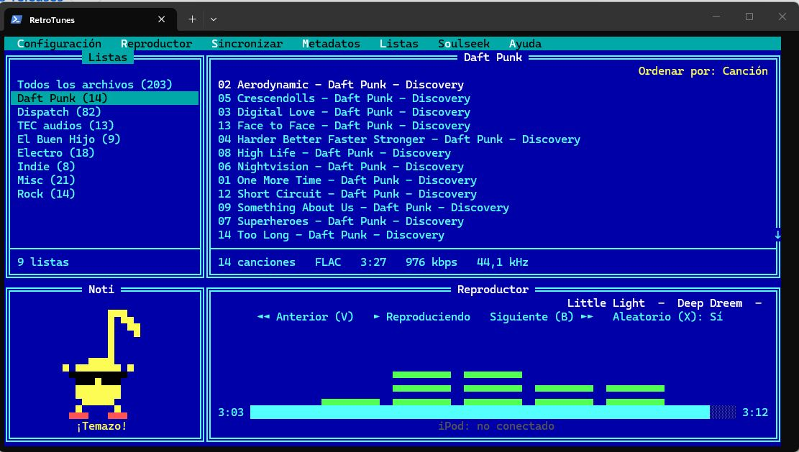

# RetroTunes — sincronizar y reproducir el iPod en Windows sin iTunes

RetroTunes es un **gestor, sincronizador y reproductor de iPod para Windows 10 y 11**,
pensado como **alternativa a iTunes** para quien todavía usa un iPod Classic o Nano. Indicas
una carpeta de música del PC y RetroTunes mantiene el iPod como un **espejo exacto** de esa
carpeta: copia lo que falta, borra lo que ya no está y crea una lista de reproducción por
cada subcarpeta. Además reproduce tu música, edita metadatos y carátulas, y descarga
canciones desde Soulseek, todo con una **interfaz de texto estilo Norton Commander**.

Este repositorio contiene solo los **instaladores públicos**. El código fuente es privado.

## Descargar

Ve a **[Releases](../../releases/latest)** y descarga una de estas dos opciones:

- **`RetroTunes-Setup-Offline.exe`** — instalador completo, **recomendado**. Incluye todo lo
  necesario (Python, motor iOpenPod, ffmpeg y Chromaprint), así que **no necesita internet**
  salvo para descargar carátulas.
- **`RetroTunes-Setup.exe`** — instalador online ligero. Descarga las dependencias durante la
  instalación.

Ambos son autoextraíbles, preguntan la carpeta de instalación y crean el acceso directo en el
escritorio. Como los `.exe` **no están firmados**, Windows SmartScreen mostrará un aviso: pulsa
"Más información" → "Ejecutar de todas formas".

Una vez instalado, RetroTunes **se actualiza solo, en silencio**: al arrancar comprueba si hay
una versión nueva y la deja aplicada para el siguiente arranque, sin tocar tu configuración ni
tus listas.

## Qué hace

**Sincronización espejo con el iPod.** Eliges una carpeta raíz y el iPod pasa a reflejarla:
copia las canciones nuevas, elimina las que ya no están, transcodifica los formatos que el
iPod no admite y genera **una lista de reproducción por subcarpeta** más una lista con todo.
Empareja las pistas del PC con las del iPod por **huella acústica**, no por nombre, así que no
duplica canciones aunque cambien las etiquetas. Escribe correctamente la base de datos
`iTunesDB` del dispositivo (con su checksum `hash58`), que es lo que un iPod necesita para
reproducir la música; no basta con copiar los archivos a la unidad.

**Reproductor integrado.** Reproduce **MP3, AAC/M4A, WMA, WAV y FLAC** de forma nativa en
Windows (OGG/OPUS con el códec gratuito Web Media Extensions). Incluye barra de progreso con
**clic para saltar** a cualquier punto, avance automático al terminar, modo aleatorio, y un
**ecualizador de espectro** que muestra el nivel real de la canción en 7 bandas de frecuencia.

**Editor de metadatos y carátulas.** Corrige título, artista, álbum, número de pista, género y
año en un editor retro. **Buscar online** rellena los campos desde la iTunes Search API
—funciona incluso sin etiquetas, buscando por el nombre del archivo— y **Descargar carátula**
incrusta la portada en el propio archivo (MP3, FLAC, M4A y OGG).

**Buscar y descargar música con Soulseek.** Integra la red **Soulseek** (mediante el daemon
open-source slskd) para buscar canciones y descargarlas directamente a tu carpeta de música,
listas para reproducir y sincronizar. Tu usuario y contraseña se guardan cifrados con DPAPI.

**Listas de reproducción propias.** Además de las automáticas por subcarpeta, puedes crear,
renombrar y editar tus propias listas; se guardan en formato `.m3u8` y se sincronizan con el
iPod igual que las demás.

**Interfaz Norton Commander, con teclado y ratón.** Dos paneles (listas y canciones), menús que
se abren con su letra resaltada y colores ANSI de 24 bits idénticos a los del DOS. Todo se
maneja también con el ratón: clic para seleccionar, doble clic para reproducir, clic derecho
para editar metadatos, rueda para desplazar y clic en la barra de progreso para saltar.

**Avisos con mascota.** Un panel de notificaciones con un pequeño personaje animado que
acompaña lo que ocurre mientras usas la aplicación.

**Seguridad de los datos.** Una **vista previa** muestra qué se copiaría y qué se borraría sin
tocar el iPod, se hace una **copia de seguridad** de la base de datos antes de la primera
escritura, y se pide confirmación antes de aplicar cambios. La sincronización es espejo (y por
tanto destructiva) por diseño.

## Compatibilidad

- **Windows 10 y 11.** Se ve mejor en Windows Terminal (colores de 24 bits).
- **iPod Classic 6G** e **iPod Nano 3G, 4G y 5G** (checksum `hash58`) — totalmente soportados.
- **iPod Video, Photo, Mini y Nano 1G/2G** (sin checksum) — deberían funcionar.
- **iPod Touch, iPhone y iPod Nano 6G/7G** (`hashAB`) — **no** están soportados.

## Preguntas frecuentes

**¿Necesito iTunes?** No. RetroTunes es independiente de iTunes y escribe la base de datos del
iPod por su cuenta. Puedes usarlo como sustituto de iTunes en un PC con Windows.

**¿Puedo pasar archivos FLAC al iPod?** Sí. Los formatos que el iPod no reproduce se
transcodifican automáticamente durante la sincronización.

**¿Se pierde la música que ya tengo en el iPod?** La sincronización es un espejo de tu carpeta:
lo que no esté en ella se borra del iPod. Usa la vista previa para ver los cambios antes de
aplicarlos, y ten tu música organizada en el PC.

**¿Funciona sin conexión a internet?** Sí, con el instalador offline. Solo se necesita internet
para descargar carátulas y para buscar en Soulseek.

**¿Es gratis?** Sí. Los instaladores de este repositorio son de descarga libre.

---

*Palabras clave: sincronizar iPod Classic en Windows 11 sin iTunes, alternativa a iTunes para
iPod, pasar música al iPod Nano, copiar FLAC al iPod, gestor de biblioteca de iPod para PC,
reproductor de iPod para Windows, editor de metadatos MP3 y FLAC, cliente de Soulseek para
Windows. Keywords: sync iPod Classic on Windows without iTunes, iTunes alternative for iPod,
transfer music to iPod Nano on PC, iPod manager and player for Windows.*
