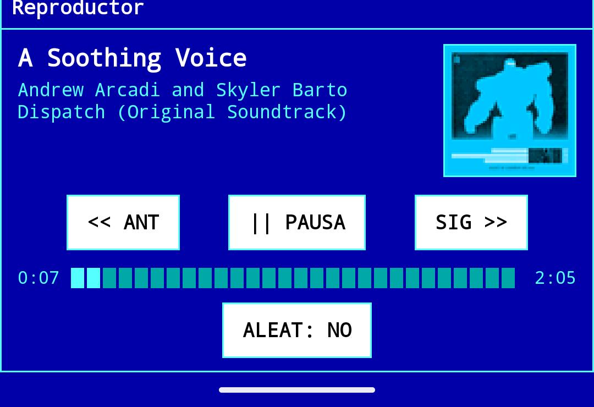
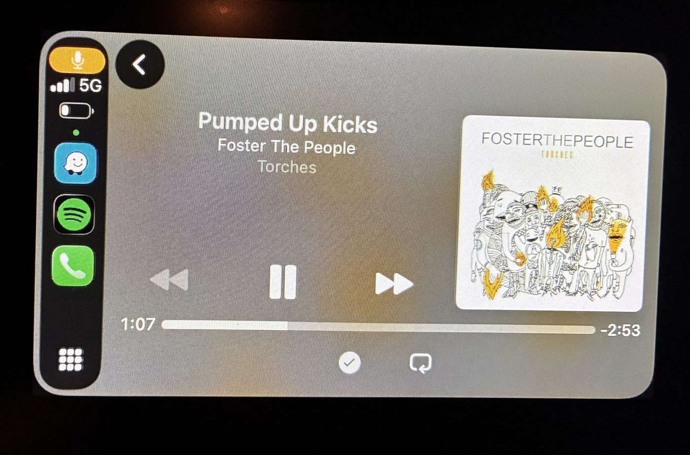

# RetroTunes — sincronizar y reproducir el iPod en Windows sin iTunes

RetroTunes es un **gestor, sincronizador y reproductor de iPod para Windows 10 y 11**,
pensado como **alternativa a iTunes** para quien todavía usa un iPod Classic o Nano. Indicas
una carpeta de música del PC y RetroTunes mantiene el iPod como un **espejo exacto** de esa
carpeta: copia lo que falta, borra lo que ya no está y crea una lista de reproducción por
cada subcarpeta. Además reproduce tu música, edita metadatos y carátulas, y está
**integrado con Soulseek** para buscar y descargar música directamente en tu biblioteca,
todo con una **interfaz de texto estilo Norton Commander**.

Y esa misma biblioteca **te la llevas fuera del PC**: RetroTunes puede servirla por
streaming para escucharla en el **móvil** y en el **coche**, con una app propia de
**Android / Android Auto** o, desde el **iPhone** y **CarPlay**, con cualquier cliente
**Subsonic** gratuito como Amperfy. No hace falta copiar nada al teléfono.

Este repositorio contiene solo los **instaladores públicos**. El código fuente es privado.

## Descargar

Ve a **[Releases](../../releases/latest)** y descarga una de estas dos opciones:

- **`RetroTunes-Setup-Offline.exe`** — instalador completo, **recomendado**. Incluye todo lo
  necesario (Python, motor iOpenPod, ffmpeg y Chromaprint), así que **no necesita internet**
  salvo para descargar carátulas.
- **`RetroTunes-Setup.exe`** — instalador online ligero. Descarga las dependencias durante la
  instalación.

Ambos son autoextraíbles, preguntan la carpeta de instalación y crean el acceso directo en el
escritorio. Como los `.exe` **no están firmados**, Windows SmartScreen mostrará un aviso: pulsa
"Más información" → "Ejecutar de todas formas".

En la misma página está el **`RetroTunes-Android-*.apk`**, la app para el móvil: descárgalo en
el teléfono y ábrelo permitiendo la instalación de orígenes desconocidos. **En el iPhone no hay
nada que descargar aquí**: se usa una app gratuita de la App Store (ver más abajo). El
`RetroTunes-App.zip` es solo para el actualizador automático; no hace falta bajarlo a mano.

Una vez instalado, RetroTunes **comprueba solo** si hay una versión nueva al arrancar. Cuando
la hay, te lo dice en el menú **Ayuda**, con las novedades y un botón para instalarla; se
aplica al reiniciar y no toca tu configuración ni tus listas.

## Qué hace

**Sincronización espejo con el iPod.** Eliges una carpeta raíz y el iPod pasa a reflejarla:
copia las canciones nuevas, elimina las que ya no están, transcodifica los formatos que el
iPod no admite y genera **una lista de reproducción por subcarpeta** más una lista con todo.
Empareja las pistas del PC con las del iPod por **huella acústica**, no por nombre, así que no
duplica canciones aunque cambien las etiquetas. Escribe correctamente la base de datos
`iTunesDB` del dispositivo (con su checksum `hash58`), que es lo que un iPod necesita para
reproducir la música; no basta con copiar los archivos a la unidad.

**Reproductor integrado.** Reproduce **MP3, AAC/M4A, WMA, WAV y FLAC** de forma nativa en
Windows (OGG/OPUS con el códec gratuito Web Media Extensions). Incluye barra de progreso con
**clic para saltar** a cualquier punto, avance automático al terminar, modo aleatorio, y un
**ecualizador de espectro** que muestra el nivel real de la canción en 7 bandas de frecuencia.

**Escúchalo en el móvil y en el coche.** RetroTunes puede **servir tu biblioteca por
streaming** desde el PC, en casa por wifi o desde fuera por Internet. La música no se copia al
teléfono: se reproduce directamente desde el ordenador, que basta con tenerlo encendido y con
RetroTunes abierto. Funciona de dos maneras, a la vez y con el mismo servidor:

- **Android y Android Auto** — con la app **RetroTunes para Android** (el `.apk` está en las
  descargas). Tiene los mismos colores que la versión de PC, con listas, controles de
  reproducción, barra de progreso por bloques, **aleatorio de tres posiciones** (no / canción /
  lista, que engancha otra lista al acabar para que la música no pare) y **carátulas al estilo
  consola de 16 bits**. En el coche aparece como una app de música más de Android Auto.
- **iPhone y CarPlay** — RetroTunes publica también una **API compatible con Subsonic**, así
  que se escucha desde el iPhone con una app gratuita de la App Store como **Amperfy**, sin
  cuenta de desarrollador de Apple ni compilar nada: basta con dar la dirección, un usuario y
  una contraseña. Sirve cualquier otro cliente Subsonic.

  
  

El acceso va protegido: la app de Android usa un **código de acceso** que genera el propio
programa y el iPhone, **usuario y contraseña** propios (guardada cifrada con DPAPI). Solo se
sirve la música de la carpeta publicada, nunca el resto del disco. Y si prefieres no abrir
puertos en el router, se puede publicar **a través de tu propio servidor web con HTTPS**.

**Editor de metadatos y carátulas.** Corrige título, artista, álbum, número de pista, género y
año en un editor retro. **Buscar online** rellena los campos desde la iTunes Search API
—funciona incluso sin etiquetas, buscando por el nombre del archivo— y **Descargar carátula**
incrusta la portada en el propio archivo (MP3, FLAC, M4A y OGG).

**Buscar y descargar música con Soulseek.** Integra la red **Soulseek** (mediante el daemon
open-source slskd) para buscar canciones y descargarlas directamente a tu carpeta de música,
listas para reproducir y sincronizar. Tu usuario y contraseña se guardan cifrados con DPAPI.

**Listas de reproducción propias.** Además de las automáticas por subcarpeta, puedes crear,
renombrar y editar tus propias listas; se guardan en formato `.m3u8` y se sincronizan con el
iPod igual que las demás.

**Interfaz Norton Commander, con teclado y ratón.** Dos paneles (listas y canciones), menús que
se abren con su letra resaltada y colores ANSI de 24 bits idénticos a los del DOS. Todo se
maneja también con el ratón: clic para seleccionar, doble clic para reproducir, clic derecho
para editar metadatos, rueda para desplazar y clic en la barra de progreso para saltar.

**Avisos con mascota.** Un panel de notificaciones con un pequeño personaje animado que
acompaña lo que ocurre mientras usas la aplicación (y tranquilo: se puede desactivar para
que no moleste).

**Seguridad de los datos.** Una **vista previa** muestra qué se copiaría y qué se borraría sin
tocar el iPod, se hace una **copia de seguridad** de la base de datos antes de la primera
escritura, y se pide confirmación antes de aplicar cambios. La sincronización es espejo (y por
tanto destructiva) por diseño.

## Compatibilidad

- **Windows 10 y 11.** Se ve mejor en Windows Terminal (colores de 24 bits).
- **iPod Classic 6G** e **iPod Nano 3G, 4G y 5G** (checksum `hash58`) — totalmente soportados.
- **iPod Video, Photo, Mini y Nano 1G/2G** (sin checksum) — deberían funcionar.
- **iPod Touch, iPhone y iPod Nano 6G/7G** (`hashAB`) — **no** están soportados *como iPod*
  (no se les puede escribir la base de datos), pero **sí** puedes escuchar tu biblioteca en
  ellos por streaming, con Amperfy.
- Para escuchar fuera del PC: **Android 7.0 o posterior** (app propia y Android Auto) y
  **iPhone** con Amperfy —o cualquier otro cliente Subsonic—, incluido **CarPlay**.

## Preguntas frecuentes

**¿Necesito iTunes?** No. RetroTunes es independiente de iTunes y escribe la base de datos del
iPod por su cuenta. Puedes usarlo como sustituto de iTunes en un PC con Windows.

**¿Puedo pasar archivos FLAC al iPod?** Sí. Los formatos que el iPod no reproduce se
transcodifican automáticamente durante la sincronización.

**¿Se pierde la música que ya tengo en el iPod?** La sincronización es un espejo de tu carpeta:
lo que no esté en ella se borra del iPod. Usa la vista previa para ver los cambios antes de
aplicarlos, y ten tu música organizada en el PC.

**¿Funciona sin conexión a internet?** Sí, con el instalador offline. Solo se necesita internet
para descargar carátulas, para buscar en Soulseek y para escuchar desde fuera de casa en el
móvil.

**¿Puedo escuchar mi música en el móvil?** Sí, por streaming desde el PC. En **Android** con la
app de RetroTunes (el `.apk` de las descargas), que además funciona en **Android Auto**. En
**iPhone**, con una app gratuita de la App Store compatible con **Subsonic** —por ejemplo
**Amperfy**—, que también vale para **CarPlay**. No se copia música al teléfono y no hay que
pagar nada.

**¿Tengo que dejar el PC encendido?** Para escuchar en el móvil, sí: la música se transmite
desde el ordenador. Lo que sincronizas con el iPod, en cambio, se queda en el iPod y suena sin
depender de nada.

**¿Hace falta abrir puertos en el router?** Solo si quieres escuchar **fuera de casa**.
RetroTunes intenta abrirlo solo por UPnP; y si tienes un servidor web propio con HTTPS, puede
publicarse a través de él y no abrir nada.

**¿Es gratis?** Sí. Los instaladores de este repositorio son de descarga libre.

---

*Palabras clave: sincronizar iPod Classic en Windows 11 sin iTunes, alternativa a iTunes para
iPod, pasar música al iPod Nano, copiar FLAC al iPod, gestor de biblioteca de iPod para PC,
reproductor de iPod para Windows, editor de metadatos MP3 y FLAC, cliente de Soulseek para
Windows, servidor de música propio en casa, escuchar mi música del PC en el móvil, servidor
Subsonic para Windows, Amperfy, música en Android Auto y CarPlay desde el ordenador.
Keywords: sync iPod Classic on Windows without iTunes, iTunes alternative for iPod, transfer
music to iPod Nano on PC, iPod manager and player for Windows, self-hosted music streaming
server, Subsonic server for Windows, stream your own music library to Android Auto and
CarPlay.*
